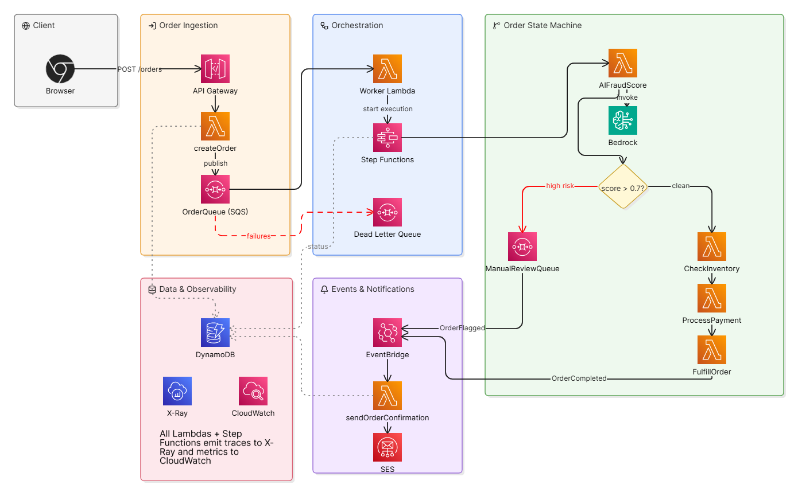

# Triage

An event-driven order processing system with AI-powered fraud detection, built on AWS.

**Live demo:** https://triage-orders.netlify.app

> **Note:** This is a portfolio project demonstrating an event-driven AWS architecture. No real payments are processed and no real orders are fulfilled.

---

## The Problem

Most order processing systems process synchronously — the client waits while the server validates, checks inventory, processes payment, and fulfills the order. This doesn't scale. A spike in traffic means requests pile up, latency grows, and the system falls over.

Triage is built async from the start. `POST /orders` returns a 201 in under 200ms. All the heavy lifting — fraud scoring, inventory, payment, fulfillment — happens in the background via an event-driven pipeline. The frontend polls for status updates every 2 seconds and shows real-time progress.

The second problem: fraud detection in order systems is usually rule-based (amount thresholds, velocity checks). Triage uses an LLM (Amazon Bedrock / Claude) to score each order on a 0–1 risk scale with natural language reasoning, then routes flagged orders to a manual review queue instead of auto-rejecting them.

---

## Architecture



Six CDK stacks deployed to AWS:

| Stack | Responsibility |
|---|---|
| `PersistenceStack` | DynamoDB orders table |
| `MessagingStack` | SQS order queue + dead-letter queue |
| `ApiStack` | API Gateway + createOrder Lambda + getOrder Lambda |
| `WorkflowStack` | Worker Lambda + Step Functions state machine |
| `EventBridgeStack` | Custom EventBridge bus + SES confirmation Lambda |
| `ObservabilityStack` | CloudWatch dashboard |

---

## How It Works

### Primary path

1. Browser submits `POST /orders` to API Gateway
2. `createOrder` Lambda validates the payload, writes the order to DynamoDB with status `PENDING`, and publishes it to SQS — returns `201` immediately
3. `worker` Lambda reads from SQS, idempotently updates status to `PROCESSING` (conditional `UpdateCommand` prevents duplicate processing), and starts a Step Functions execution
4. Step Functions runs `AIFraudScore → Choice → CheckInventory → ProcessPayment → FulfillOrder → PublishOrderCompleted`
5. `AIFraudScore` calls Amazon Bedrock (Anthropic API) with order context and writes a risk score (0–1) and reasoning to DynamoDB
6. Clean orders (score ≤ 0.7) continue through the workflow; status is updated at each step
7. On completion, Step Functions publishes `OrderCompleted` to a custom EventBridge bus
8. `sendOrderConfirmation` Lambda fetches the order from DynamoDB, sends a confirmation email to the customer via SES

### Fraud path

Orders scoring above 0.7 are routed to a `ManualReviewQueue` (SQS) and an `OrderFlagged` event is published to EventBridge. The frontend displays the fraud score and Bedrock's reasoning.

### Failure handling

- Each Step Functions step has 2 retries with exponential backoff, routing to a `Fail` state on exhaustion
- SQS messages that fail 3 delivery attempts are moved to a dead-letter queue
- DLQ depth is tracked on the CloudWatch dashboard

---

## Tech Choices and Tradeoffs

**Step Functions over a pure SQS chain** — each workflow step has its own retry policy, branching logic (the fraud score choice), and a clear visual representation of state. A pure SQS chain would require each Lambda to know where to publish next, spreading routing logic across multiple functions.

**Bedrock (LLM) over rule-based fraud scoring** — rule-based systems require you to enumerate every fraud pattern upfront. An LLM reasons over the full order context and can surface non-obvious signals (unusual item combinations, mismatched customer/amount patterns) with a human-readable explanation.

**DynamoDB on-demand over provisioned** — provisioned capacity requires capacity planning upfront. Under the load test, the default 5 WCU/s caused ~45% request failures. On-demand scales to the actual request rate instantly at the cost of slightly higher per-request pricing.

**EventBridge over direct Lambda invocation** — publishing domain events (`OrderCompleted`, `OrderFlagged`) to an event bus decouples the workflow from its consumers. Adding a new downstream (analytics, notifications, etc.) requires only a new EventBridge rule, not a change to the workflow.

---

## Observed Metrics

**Load test** — 400 VUs, 30s ramp, 1-minute hold (k6, 33,440 total requests):

| Metric | Value |
|---|---|
| Throughput | 277 req/s |
| p95 latency | 113ms |
| p99 latency | 173ms |
| Success rate | 99.28% |

The 0.71% errors at this load are Lambda concurrency throttles during ramp — under the account's 1000 unreserved concurrency limit, ~5 Lambdas in the workflow per order (~2,500 invocations/sec target) briefly outpaced container scale-up. Bedrock runs async inside Step Functions and does not contribute to `POST /orders` latency.

**Lambda memory tuning** — AWS Lambda Power Tuning across 128/256/512/1024MB (10 invocations each):

| Lambda | Before | After | Speedup |
|---|---|---|---|
| createOrder | 128MB | 256MB | 5x |
| worker | 128MB | 512MB | 55x |
| checkInventory | 128MB | 1024MB | 112x |
| processPayment | 128MB | 512MB | 32x |
| fulfillOrder | 128MB | 512MB | 5x |

---

## Tech Stack

- **Languages:** TypeScript (CDK + Lambda handlers), JavaScript (k6)
- **AWS:** Lambda, API Gateway, SQS, Step Functions, DynamoDB, EventBridge, SES, Bedrock, CloudWatch, X-Ray
- **IaC:** AWS CDK v2
- **Frontend:** Next.js, Tailwind CSS v4, deployed on Netlify
- **Testing:** Jest (unit tests), k6 (load testing)

---

## Getting Started

### Prerequisites

- Node.js 22+
- AWS CLI configured (`aws configure`)
- AWS CDK v2 (`npm install -g aws-cdk`)
- An AWS account with Bedrock model access enabled for Claude (us-east-1)
- A verified SES sender email address

### Deploy

```bash
cd backend
npm install
cdk bootstrap
cdk deploy --all
```

### Run tests

```bash
cd backend
npm test
```

### Frontend

```bash
cd frontend
npm install
```

Create `.env.local`:

```
NEXT_PUBLIC_API_URL=<API Gateway URL from CDK output>
NEXT_PUBLIC_API_KEY=<API Key from AWS console>
```

```bash
npm run dev
```
